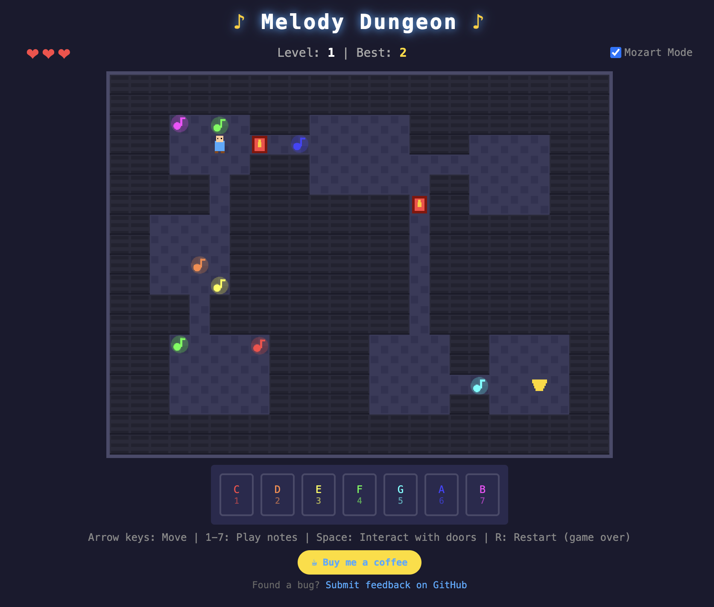

# ♪ Melody Dungeon ♪

A browser-based musical dungeon crawler where you collect notes and solve melody puzzles to escape procedurally generated dungeons.

🎮 [Try it live here!](https://bufordeeds.github.io/melody-dungeon/)



## How to Play

### Goal
Navigate through the dungeon, collect musical notes, and solve Simon Says-style melody puzzles to unlock doors and reach the exit.

### Controls

**Desktop:**
- **Arrow Keys / WASD** - Move
- **1-7** - Play notes (C, D, E, F, G, A, B)
- **Space** - Interact with locked doors
- **R** - Restart (when game over)

**Mobile:**
- **D-Pad** - Move (tap or hold)
- **Note Buttons** - Play collected notes
- **Interact** - Open door puzzles
- **Restart** - Start over after game over

### Gameplay

1. **Explore** the dungeon and collect musical notes (floating colored symbols)
2. **Approach a locked door** and press Space/Interact to start the puzzle
3. **Listen** to the melody the door plays
4. **Repeat** the melody using the correct notes
5. **Unlock the door** and continue to the exit
6. **Progress** through increasingly difficult levels

### Lives System
- Start with 3 lives (❤❤❤)
- Lose a life for each wrong note in a puzzle
- Gain a life when completing a level
- Game over at 0 lives

### Settings
- **Hide notes during playback** - When enabled, the note display is hidden while the melody plays, making it harder to memorize (enabled by default for a challenge!)

## Features

- 🎵 **Musical Puzzles** - Simon Says-style melody memorization
- 🏰 **Procedural Generation** - Every dungeon is unique
- 📱 **Mobile Friendly** - Touch controls for phones and tablets
- 🏆 **High Scores** - Track your best level (saved locally)
- 🎨 **Pixel Art Style** - Retro aesthetic with no external images
- 🔊 **Web Audio** - Synthesized notes using the Web Audio API

## Run Locally

Since this uses ES modules, you need a local server:

```bash
# Using Python
python -m http.server 8000

# Using Node.js
npx serve .

# Using PHP
php -S localhost:8000
```

Then open `http://localhost:8000` in your browser.

## Tech Stack

- **Vanilla JavaScript** - No frameworks
- **HTML5 Canvas** - 2D rendering
- **Web Audio API** - Sound synthesis
- **ES Modules** - Clean code organization
- **localStorage** - High score persistence

## Project Structure

```
melody-dungeon/
├── index.html      # Main HTML + CSS
├── js/
│   ├── main.js     # Entry point
│   ├── constants.js # Shared constants
│   ├── audio.js    # Web Audio synthesis
│   ├── input.js    # Keyboard + touch input
│   ├── renderer.js # Canvas drawing
│   ├── dungeon.js  # Procedural generation
│   └── game.js     # Game state + logic
├── README.md
└── PLAN.md         # Original design doc
```

## Contributing

Found a bug or have a suggestion? [Open an issue on GitHub](https://github.com/bufordeeds/melody-dungeon/issues)

## Support

If you enjoy the game, consider [buying me a coffee](https://buymeacoffee.com/bufordeeds) ☕

## License

MIT License - feel free to fork and modify!
